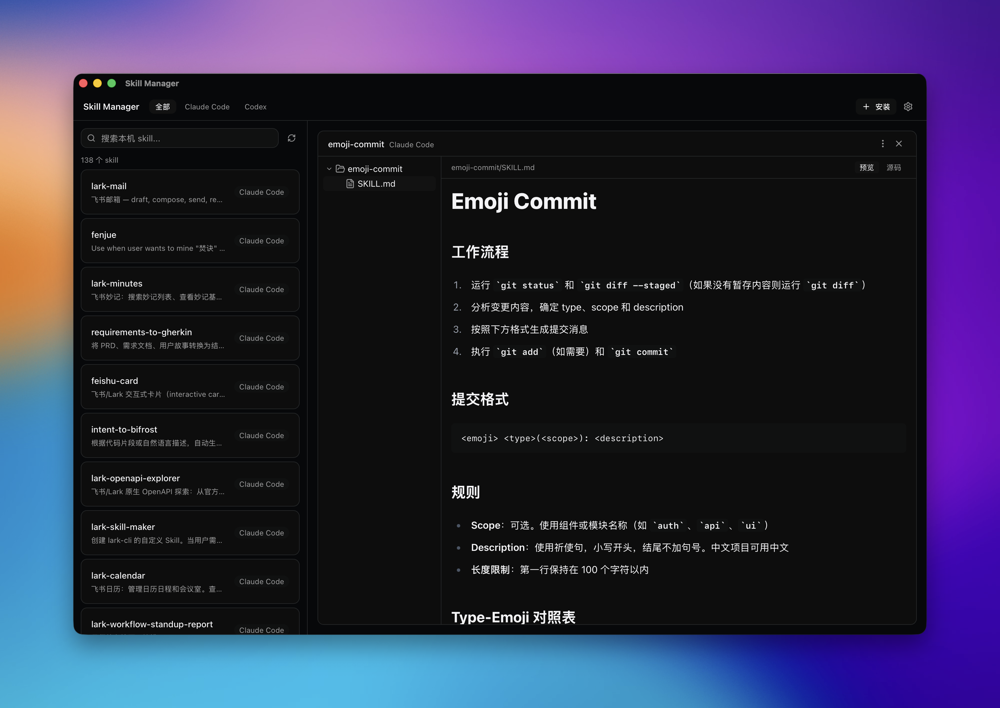
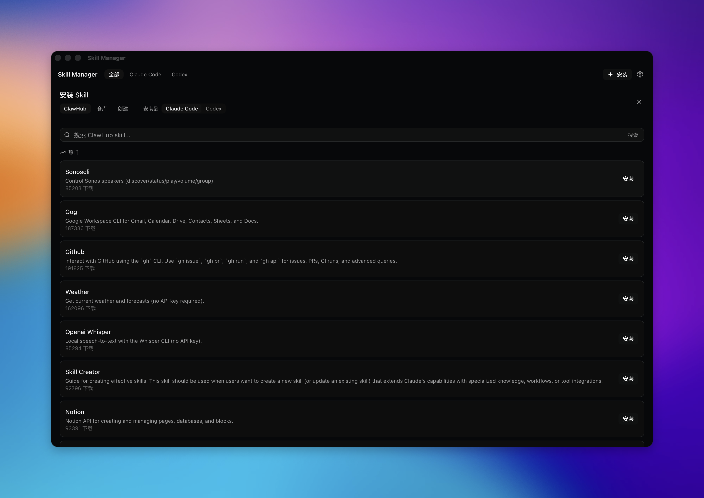

# Skill Manager

---

English | [中文](README.zh-CN.md)

A cross-provider desktop manager for **Agent Skills**. Browse, inspect, install, and remove skills for [Claude Code](https://claude.com/claude-code) and [Codex](https://openai.com/codex/) from one place, instead of manually `git clone`-ing and copying directories.

<p align="center">


</p>

## Screenshots

| Browse local skills | Install from ClawHub |
| --- | --- |
|  |  |

## Features

- **Unified cross-provider view**: see every skill installed for Claude Code (`~/.claude/skills`) and Codex (`~/.agents/skills`) in one window, filterable by provider, searchable by name.
- **Visual inspection**: a directory tree plus a file viewer that renders `SKILL.md` directly — no need to dig through files in a terminal.
- **Install from multiple sources**:
  - search and install from the [ClawHub](https://clawhub.ai) marketplace;
  - paste a link to a skill directory inside any GitHub repo and install it directly;
  - add any git repository as a persistent skill source and browse/install everything inside it;
  - create a brand-new skill locally (with `SKILL.md` frontmatter scaffolded automatically).
- **Safe install/uninstall confirmations**: overwriting an existing skill clearly warns that its directory will be deleted and rewritten, irreversibly; skills that ship hooks or MCP config are flagged before install since they will execute.
- **Read-only by design**: never touches enable/disable state or provider config files — every action is a plain file-level install or uninstall.

## Non-goals

- No enabling/disabling of skills (would require invasively editing config/frontmatter).
- No in-app editing of `SKILL.md`.
- No scanning of project-level (`.claude/skills`, `.agents/skills`) or ADMIN-scope directories.
- No automatic update detection — updating means reinstalling to overwrite.
- No marketplace-wide search — repository search only covers repos you've added.
- **macOS only**, for now.

## Download & Install

Grab the latest `.dmg` from the [Releases](https://github.com/TopGrd/skill-manager/releases) page.

> The app isn't signed or notarized by an Apple Developer account yet, so macOS Gatekeeper will likely block the first launch with a "damaged" or "unidentified developer" warning. Work around it with either:
>
> - Right-click `Skill Manager.app` in Finder → **Open**, then confirm **Open** again in the dialog; or
> - Run `xattr -cr /Applications/Skill\ Manager.app` in a terminal.

## Local Development

### Prerequisites

- [Node.js](https://nodejs.org/) 20+
- [pnpm](https://pnpm.io/) (this repo pins `pnpm@10.33.0` — `corepack enable` will pick it up automatically)
- [Rust](https://www.rust-lang.org/tools/install) stable, via `rustup`
- macOS: Xcode Command Line Tools (`xcode-select --install`; the full Xcode install isn't required)

See the [Tauri prerequisites guide](https://v2.tauri.app/start/prerequisites/) for full platform details.

### Commands

```bash
# install dependencies
pnpm install

# run in development mode (hot reload, Rust backend included)
pnpm tauri dev

# build a production installer
pnpm tauri build

# run the Rust backend test suite
cd src-tauri && cargo test
```

### Project layout

```
src/            React frontend (Tauri WebView)
src-tauri/      Rust backend (Tauri commands: scanning, git operations, install/uninstall)
```

## Contributing

Issues and pull requests are welcome.

1. Fork the repo and branch off `main`.
2. Before submitting, make sure `pnpm build` (TypeScript typecheck) and `cd src-tauri && cargo test` both pass.
3. Please follow [Conventional Commits](https://www.conventionalcommits.org/) for commit messages (e.g. `fix: ...`, `feat: ...`).
4. Describe the motivation and how you verified the change in your PR; screenshots are appreciated for UI changes.

## License

[MIT](LICENSE)
